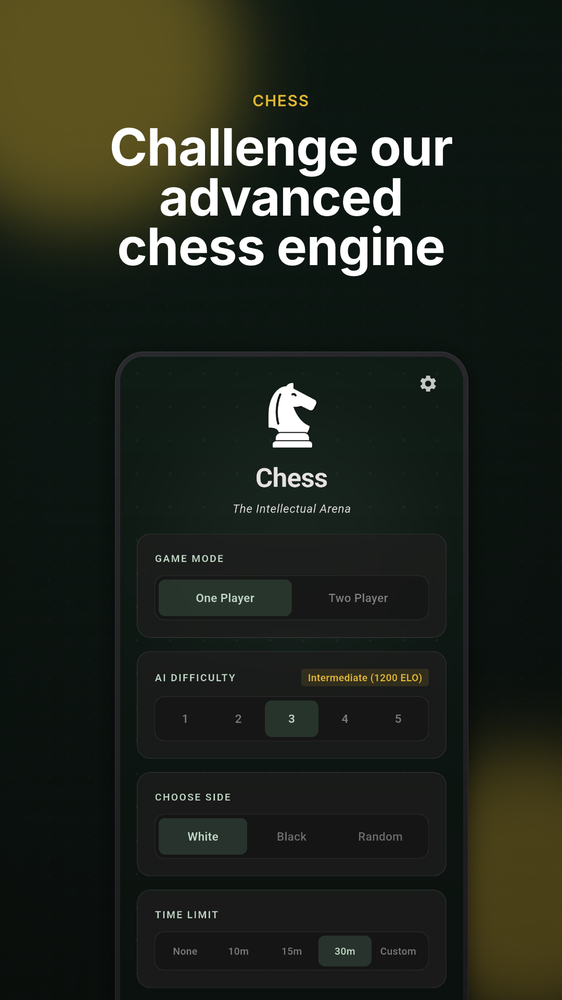
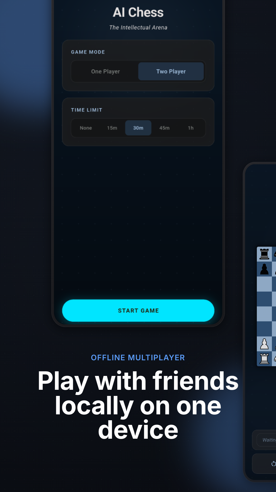
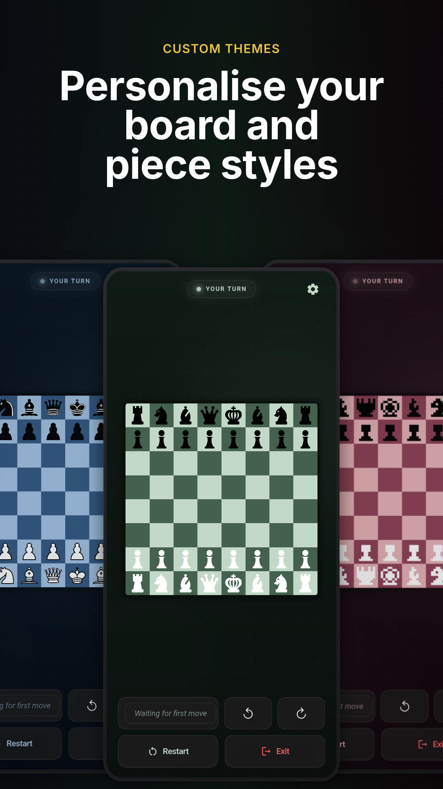
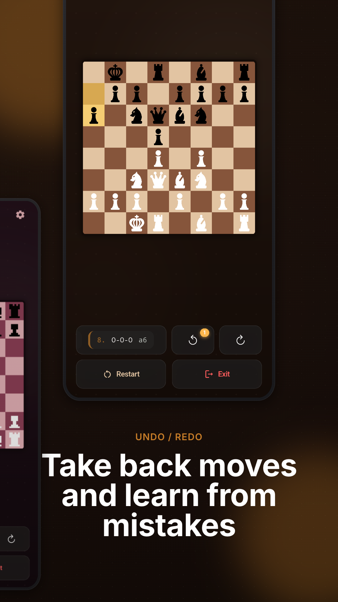
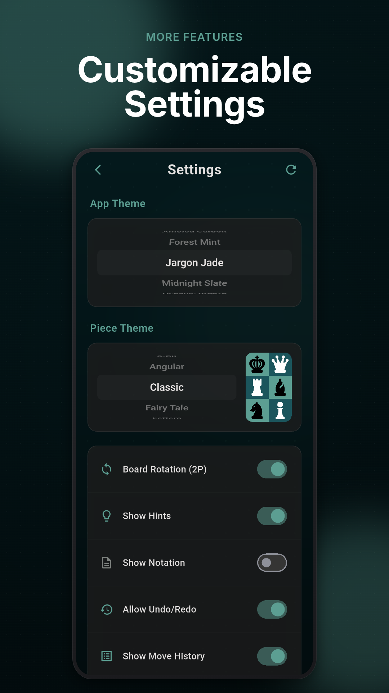

<a href='https://play.google.com/store/apps/details?id=com.shenmareparas.chess'></a>

# ♟️ AI Chess - Flutter Chess Game

A feature-rich chess application built with **Flutter** and the **Flame** engine. It supports single-player games against the world-class **Stockfish Chess Engine** with multiple difficulty levels, offline two-player play, timed games, customizable boards, multiple piece styles, sound effects, haptic feedback, and local preference persistence with game-state save/resume.

[](https://flutter.dev)
[](https://dart.dev)
[](LICENSE)

<a href='https://play.google.com/store/apps/details?id=com.shenmareparas.chess'></a>

## ✨ Features

### 🎮 Game Modes

-   **Single Player**: Play against an intelligent AI opponent with 5 difficulty levels
-   **Two Player Mode**: Offline multiplayer on the same device, with per-player side selection
-   **Side Selection**: Choose to play as white, black, or random
-   **Timed Games**: Optional time controls for competitive play, supporting Fischer Increment and USCF Simple Delay modes
-   **Game Save & Resume**: Exit mid-game and resume from the exact same position later

### 🎨 Customization

-   **8 Beautiful Themes**: Amoled Carbon, Forest Mint, Jargon Jade, Midnight Slate, Oceanic Breeze, Royal Velvet, Warm Walnut, and Winter Glacier
-   **6 Piece Themes**: Classic, Angular, 8-Bit, Letters, Old School, and Fairy Tale
-   **Dark Mode Support**: Multiple dark theme options including pure AMOLED black
-   **Custom Font**: Inter font for clean, readable UI typography
-   **Settings Reset**: One-tap reset to factory defaults via a confirmation dialog
-   **⚡ Performance Optimizations**:
    -   **R8 Minification & Size Reductions**: Uses Proguard rules and R8 optimization to strip unused assets and code in release configurations.
    -   **Native Library Compression**: Bundles compressed `.so` binaries (using `useLegacyPackaging = true`), saving over 140MB on the final APK size.
    -   **Scroll-Debounced Pickers**: App theme and piece theme wheels are debounced (150ms) to avoid heavy layout and theme rebuilds during scroll.
    -   **Lightweight Previews**: Piece preview uses a cached Flutter `StatelessWidget` asset renderer rather than re-instantiating heavy Flame `Game` states.
    -   **Sequential Asset Preloading**: Remaining piece theme images are preloaded sequentially (one theme at a time, 100ms apart) after a 3-second startup delay, protecting main-thread frame metrics.
    -   **Isolated Background Repaints**: Heavy background paint layers (dot grids and radial blurs) are wrapped in `RepaintBoundary` objects and isolated via `Selector` to prevent unnecessary redraws.
    -   **Deferred Flame Init**: Board and sprite initialization is deferred to a `addPostFrameCallback` so it doesn't block the page transition animation.

### 🎯 Gameplay Features

-   **Move History**: Track all moves throughout the game using Standard Algebraic Notation (SAN)
-   **Undo/Redo with Ad Bank**: Start each game with 1 free undo; earn an extra undo by watching a rewarded ad
-   **Move Hints**: Visual indicators for valid moves
-   **Edge-to-Edge Flat Board Layout**: Stretches right to the borders of the screen with flat, border-aligned sharp corners (no rounded corners or shadows).
-   **Alternating Board Notation**: Algebraic coordinates on the board borders dynamically use the alternating background tile color (e.g. dark text on light tiles, light text on dark tiles) for crisp legibility.
-   **Sound Effects**: Audio feedback for piece movements using a pooled `AudioPool` for rapid playback
-   **Haptic Feedback**: Configurable vibration patterns — light for moves, medium for captures/checks, heavy for stalemates, vibrate for checkmates
-   **Board Rotation**: Automatic board rotation based on turn (configurable)
-   **Promotion Handling**: Full support for glassmorphic pawn promotion dialog (wrapped in `PopScope(canPop: false)` to require an explicit piece choice)
-   **Check Detection**: Visual indicators for check and checkmate
-   **Stalemate Detection**: Proper game-end condition handling

### 🤖 AI Features

-   **World-Class Engine**: Powered by the highly optimized **Stockfish 18** engine.
-   **Castling UCI Translation**: Features automated castling move translation mapping custom king-captures-rook engine moves to standard UCI notation (e.g. `e1g1`, `e1c1`), preventing AI logic desyncs and crash states.
-   **5 Difficulty Levels**: Mapped to customizable engine skill levels (0-20), search depths (3-16), and response time thresholds.
-   **Configurable Engine Selector**: Choose between the built-in local engine (Minimax) or the powerhouse Stockfish AI.
-   **Real-time Move Logs**: Asynchronous stdin/stdout UCI command processing with debug logging.
-   **Safe Cancellation**: Search calculations are run asynchronously and cleanly cancelled on game restart or exit.

### 🏆 Achievements

-   **Google Play Games Services** (Android) integration via `games_services` (disabled/hidden on iOS)
-   8 achievements: First Game, First Win, Beat Level 5, Timed Win, Pawn Promotion, Put in Check, Play 10 Games (incremental), Play 50 Games (incremental)
-   Silent sign-in on startup; interactive sign-in and native achievements UI on demand (Android only)


## 📸 Screenshots

<p align="center">
  
  
  
  
  
</p>

## 🛠️ Technologies Used

-   **[Flutter](https://flutter.dev/)** — UI framework (Dart ≥ 3.0.0, app version `1.0.3+4`)
-   **[Flame](https://flame-engine.org/)** — 2D game engine for chess board rendering
-   **[Provider](https://pub.dev/packages/provider)** — State management
-   **[Shared Preferences](https://pub.dev/packages/shared_preferences)** — Local data persistence (settings & full game-state save/restore)
-   **[Flame Audio](https://pub.dev/packages/flame_audio)** — Sound effects with pooled `AudioPool` for rapid move sounds
-   **[Google Mobile Ads](https://pub.dev/packages/google_mobile_ads)** — Rewarded interstitial ads ("1 Ad = 1 Undo" mechanic)
-   **[Games Services](https://pub.dev/packages/games_services)** — Google Play Games (Android) achievements
-   **[Confetti](https://pub.dev/packages/confetti)** — Celebration effects on win
-   **[Fluttertoast](https://pub.dev/packages/fluttertoast)** — Native platform toast notifications (developer Easter egg countdown)
-   **[async](https://pub.dev/packages/async)** — `CancelableOperation` for cancellable AI compute tasks
-   **[in_app_update](https://pub.dev/packages/in_app_update)** — Google Play Store in-app updates for Android

## 📦 Installation

### Prerequisites

-   Flutter SDK (3.0.0 or higher)
-   Dart SDK (3.0.0 or higher)
-   Android Studio / Xcode (for mobile development)
-   A device or emulator

### Steps

1. **Clone the repository**

    ```bash
    git clone https://github.com/shenmareparas/Chess.git
    cd Chess
    ```

2. **Install dependencies**

    ```bash
    flutter pub get
    ```

3. **Run the app**

    ```bash
    flutter run
    ```

4. **Build for production** (optional)

    ```bash
    # Android
    flutter build apk --release

    # iOS
    flutter build ios --release
    ```

### 🎨 Marketing & Screenshots Editor

To design, preview, and bulk-export Google Play Store screenshots:

1. **Navigate to the editor directory**
    ```bash
    cd screenshots_editor
    ```
2. **Install dependencies**
    ```bash
    bun install   # or npm install / pnpm install / yarn install
    ```
3. **Start the local server**
    ```bash
    bun dev       # or npm run dev / pnpm dev / yarn dev
    ```
4. **Open in browser**
    Visit [http://localhost:3000](http://localhost:3000) to edit layouts, snap-center elements, toggle bezel notches, adjust background film noise, and export high-resolution assets.


## 📁 Project Structure

```
lib/
├── main.dart                       # App entry point; preloads assets, initializes AdMob & Play Games
├── model/
│   ├── app_model.dart             # Central state: game lifecycle, undo bank, save/restore, prefs delegation
│   ├── app_themes.dart            # 8 board/UI theme definitions (sorted alphabetically)
│   ├── user_preferences.dart      # SharedPreferences wrapper; defines PIECE_THEMES constant
│   └── player.dart                # Player enum (player1, player2, random)
├── logic/
│   ├── chess_board.dart           # Flame-based board representation and rendering
│   ├── chess_game.dart            # Flame Game subclass; wires sprites to board state
│   ├── game_controller.dart       # Move orchestration, AI trigger, undo/redo, promotion, haptics
│   ├── chess_piece.dart           # ChessPiece model and ChessPieceType enum
│   ├── chess_piece_sprite.dart    # Flame Sprite component for chess pieces
│   ├── chess_constants.dart       # Shared constants (e.g. PROMOTIONS list)
│   ├── shared_functions.dart      # Utilities: formatPieceTheme, oppositePlayer, tile↔coordinate helpers
│   ├── game_state_storage.dart    # Full game-state save/load/clear via SharedPreferences
│   ├── timer_service.dart         # Per-player countdown timers with pause/resume support
│   ├── audio_service.dart         # Pooled piece-move sounds and game-end audio
│   ├── haptic_service.dart        # Centralized haptic feedback (selection/light/medium/heavy/vibrate)
│   ├── ad_service.dart            # RewardedInterstitialAd singleton ("1 Ad = 1 Undo")
│   ├── play_games_service.dart    # GPGS/Game Center achievements singleton
│   ├── in_app_update_service.dart # In-app updates via Google Play Store (Android only)
│   └── move_calculation/
│       ├── ai_move_calculation.dart   # Minimax + alpha-beta pruning (runs in isolate)
│       ├── ai_move_args.dart          # Isolate argument container
│       ├── openings.dart              # Opening book
│       ├── piece_square_tables.dart   # Position evaluation tables
│       ├── transposition_table.dart   # TT with softClear() for GC efficiency
│       └── move_classes/
│           ├── move.dart              # Move (from, to, promotionType)
│           ├── move_meta.dart         # Move metadata (isCheck, isCheckmate, isStalemate, promotion)
│           ├── move_stack_object.dart # Board move-stack entry
│           ├── move_and_value.dart    # AI search result container
│           └── direction.dart         # Direction enum for sliding pieces
└── views/
    ├── main_menu_view.dart        # Main menu: game mode, difficulty, time, side selection
    ├── chess_view.dart            # Game screen: board, timers, controls, confetti, exit dialog
    ├── settings_view.dart         # Settings: theme pickers, toggles, achievements tile, reset
    └── components/
        ├── chess_view/
        │   ├── chess_board_widget.dart         # Flutter↔Flame GameWidget bridge
        │   ├── promotion_dialog.dart           # Non-dismissible glassmorphic promotion picker
        │   ├── promotion_option.dart           # Individual promotion piece option
        │   ├── game_info_and_controls.dart     # Bottom panel layout
        │   └── game_info_and_controls/
        │       ├── game_status.dart            # Turn/result status text
        │       ├── timer_widget.dart           # Animated countdown timer display
        │       ├── timers.dart                 # Dual-timer row
        │       ├── moves_undo_redo_row.dart    # Undo/redo controls row
        │       ├── restart_exit_buttons.dart   # Restart and exit action buttons
        │       └── rounded_alert_button.dart   # Styled alert/action button
        ├── main_menu_view/
        │   ├── main_menu_buttons.dart          # Start / Resume game buttons
        │   ├── game_options.dart               # Options panel container
        │   └── game_options/
        │       ├── game_mode_picker.dart       # 1P / 2P mode selection
        │       ├── ai_difficulty_picker.dart   # Difficulty 1-5 selection
        │       ├── ai_engine_picker.dart       # AI Engine (Stockfish vs Minimax) selection
        │       ├── time_limit_picker.dart      # Time control selection
        │       ├── timer_increment_picker.dart # Time increment value selection
        │       ├── timer_mode_picker.dart      # Time control mode (Fischer increment vs USCF delay)
        │       ├── side_picker.dart            # White / Black / Random side picker
        │       └── picker.dart                 # Shared picker primitive
        ├── settings_view/
        │   ├── app_theme_picker.dart           # Board theme CupertinoPicker (debounced 150ms)
        │   ├── piece_theme_picker.dart         # Piece theme CupertinoPicker + Easter egg
        │   ├── piece_preview.dart              # Lightweight StatelessWidget piece preview
        │   └── toggles.dart                   # All settings toggles + Achievements tile
        └── shared/
            ├── glass_panel.dart               # Glassmorphic container with optional animation
            ├── rounded_button.dart            # Reusable rounded button
            ├── text_variable.dart             # Styled text helper
            └── bottom_padding.dart            # Safe-area bottom padding
```

## 🧠 AI Engine & Algorithm

The chess application interfaces with the **Stockfish Chess Engine** using the **UCI (Universal Chess Interface)** protocol via Dart FFI.

### How It Works

1. **UCI Protocol Integration**: The app sends standard chess commands (`position startpos moves ...`, `go depth X movetime Y`) to the engine's standard input and listens to its standard output for search information and the computed `bestmove`.
2. **Readiness Synchronization**: To prevent race conditions, the engine uses event-driven synchronization (`readyok` response completers) before executing position evaluations.
3. **Engine Settings mapping**:
    - **Level 1 (Novice)**: Skill level 3, depth 3, thinking time limit 150ms.
    - **Level 2 (Easy)**: Skill level 7, depth 5, thinking time limit 300ms.
    - **Level 3 (Medium)**: Skill level 12, depth 8, thinking time limit 600ms.
    - **Level 4 (Hard)**: Skill level 16, depth 12, thinking time limit 1200ms.
    - **Level 5 (Master)**: Skill level 20, depth 16, thinking time limit 2000ms.

**Learn more**: [Stockfish Chess Engine Official Website](https://stockfishchess.org/)

## ⚙️ Configuration

The app stores user preferences locally using SharedPreferences:

-   Selected board theme (`themeName`)
-   Piece theme preference (`pieceTheme`)
-   Move history visibility (`showMoveHistory`)
-   Sound enabled (`soundEnabled`)
-   Hint display settings (`showHints`)
-   Board notation visibility (`showNotation`)
-   Board rotation preference (`enableRotation`)
-   Undo/Redo availability (`allowUndoRedo`)
-   Haptic feedback (`hapticEnabled`)

Defaults are defined in `lib/model/user_preferences.dart`. Game state (board position, move history, timers, undo bank) is persisted separately in `lib/logic/game_state_storage.dart` and restored on app resume.

## 🎯 Usage

1. **Start a New Game**: From the main menu, configure your game settings
2. **Select Mode**: Choose between 1-player (vs AI) or 2-player mode
3. **Choose Difficulty**: For AI games, select from 5 difficulty levels
4. **Choose Side**: Pick White, Black, or Random for either game mode
5. **Set Time**: Optionally enable a time control
6. **Customize**: Pick your preferred theme and piece style in Settings
7. **Play**: Tap pieces to select them, then tap valid squares to move
8. **Save & Resume**: Exit mid-game to save progress and continue later from the main menu

## 🤝 Contributing

Contributions are welcome! Here's how you can help:

1. Fork the repository
2. Create a feature branch (`git checkout -b feature/amazing-feature`)
3. Commit your changes (`git commit -m 'Add some amazing feature'`)
4. Push to the branch (`git push origin feature/amazing-feature`)
5. Open a Pull Request

## 📝 License

This project is licensed under the MIT License.

## 👨‍💻 Author

**Paras Shenmare**

-   GitHub: [@shenmareparas](https://github.com/shenmareparas)
-   Google Play: [Download Chess](https://play.google.com/store/apps/details?id=com.shenmareparas.chess)

## 🙏 Acknowledgments

-   Chess piece graphics from various open-source sets
-   Inter font
-   Flutter and Flame communities

## 📞 Support

If you encounter any issues or have suggestions, please [open an issue](https://github.com/shenmareparas/Chess/issues).

---

⭐ If you like this project, please give it a star on GitHub!
